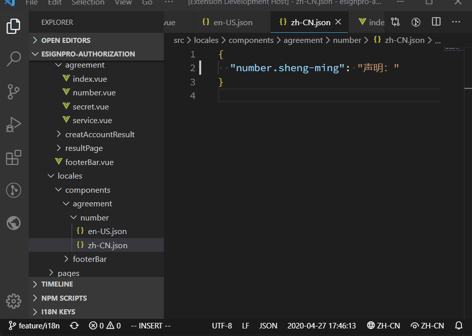

# i18n-esign README

简单的 VSCode 插件, 一看就会用

## Features

用于合并多语言文件, 生成导入到 crm 的 Excel 文件

## Requirements

目前无要求

## Extension Settings

目前没有配置项

## Known Issues

目前没有

## Release Notes

Users appreciate release notes as you update your extension.

### 1.0.0

第一版

### For more information

* 联系 @陈辅

**Enjoy!**
